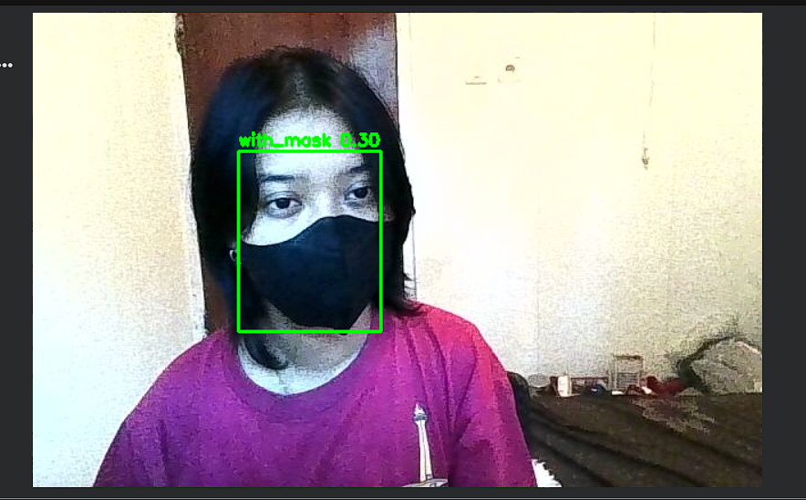
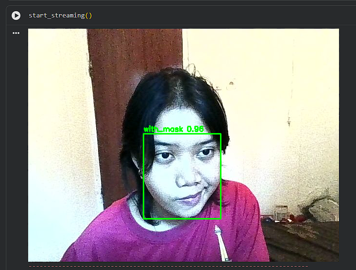

# Mask-Detection-YOLOv8
Repository ini merupakan UAS multimedia cerdas ole Yuliana Puspita Sari
# Deteksi Masker Real-Time Menggunakan YOLOv8 nano

Proyek ini merupakan implementasi sistem deteksi masker secara *real-time* berbasis *deep learning* menggunakan model **YOLOv8 kustom**. Sistem ini dirancang untuk mendeteksi apakah seseorang sedang menggunakan masker (`with_mask`) atau tidak menggunakan masker (`without_mask`) melalui input kamera/webcam. Proyek ini disusun sebagai bagian dari pemenuhan tugas Ujian Akhir Semester (UAS).

---

## 📊 Penjelasan Dataset

Dataset yang digunakan dalam proyek ini bersumber dari platform **Roboflow**. 
* **Nama Ruang Kerja (Workspace):** yuliana-puspita-sari
* **Nama Proyek:** mask-detection-oefcl-1jmhh
* **Format Ekspor:** YOLOv8
* **Jumlah Kelas:** 2 Kelas (`with_mask` dan `without_mask`)

Dataset ini berisi kumpulan gambar wajah manusia dengan variasi kondisi menggunakan masker dan wajah polos tanpa masker yang telah diberi kotak pembatas (*bounding box*) secara presisi. Model dilatih (*training*) di lingkungan Google Colab menggunakan akselerasi GPU T4 sebanyak **50 Epochs** guna mendapatkan tingkat akurasi dan sensitivitas deteksi yang optimal.

---

## 📷 Hasil Uji Coba Kamera (Real-Time Detection)

Berikut adalah dokumentasi hasil pengujian model kustom YOLOv8 menggunakan fungsi *streaming webcam* secara langsung:

### 1. Terdeteksi Menggunakan Masker (`with_mask`)
Ketika wajah dihadapkan ke kamera dengan menggunakan masker, model berhasil mendeteksi objek dengan label `with_mask`.

### 2. Terdeteksi Tidak Menggunakan Masker (`without_mask`)
Ketika masker dilepas, model secara responsif mengubah deteksi dan memunculkan kotak pembatas dengan label `without_mask`.

---

## 🛠️ Cara Menjalankan Proyek di Google Colab

1. Unggah file notebook `Yulianaps_uas_yolo.ipynb` ke Google Colab kamu.
2. Pastikan jenis runtime sudah diubah ke **T4 GPU** (*Runtime > Change runtime type > T4 GPU*).
3. Jalankan sel pertama untuk mengunduh dataset secara otomatis dari Roboflow API.
4. Jalankan proses *training* model dengan mengeksekusi skrip Python YOLO kustom.
5. Jalankan fungsi `start_streaming()` paling bawah untuk mengaktifkan kamera laptop dan melihat hasil deteksi secara langsung.
